# PyKanban

Easy way to create kanban board in terminal

<p align="center">
    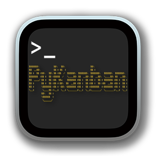
</p>

___

## Table of Contents

- [Description](#description)
- [Motivation](#motivation)
- [Features](#features)
- [How to use](#how-to-use)
  - [Installation](#installation)
  - [Usage](#usage)
    - [View Tables](#for-view-tables)
      - [Add a Card](#add-a-card)
      - [Move a Card](#move-a-card)
      - [Delete a Card](#delete-a-card)
      - [View History](#view-history)
      - [Back to Main Screen](#back-to-main-screen)
    - [Create Table](#for-create-table)
    - [Exit](#for-exit)
- [Fundamentals and Technologies are used](#fundamentals-and-technologies-are-used)
  - [Fundamentals](#programming-fundamentals)
  - [Technologies](#technologies)
- [Code]()

___

## Description

PyKanban is a terminal application for creating a simple kanban board or any table for any purpose uses cards in an awesome terminal view

### Screenshot

<p align="center">
    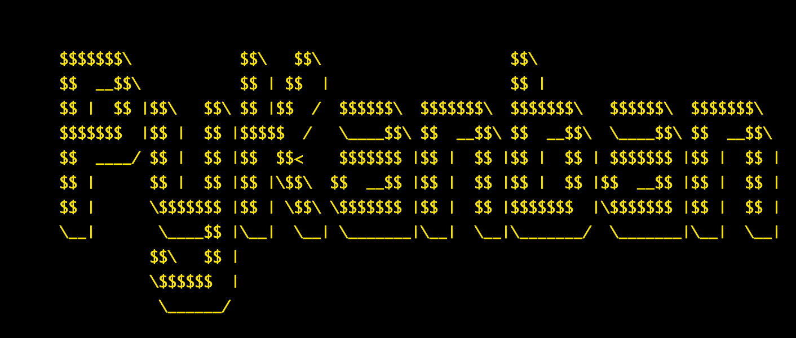
</p>

___

## Motivation

First, as is common among developers, it's awesome for using terminal applications. And I found all applications that help us for creating tables for organizing our tasks use GUI. So, I found it will be great if I try to develop a simple application that uses a terminal. Second, it's my final project for <a href="https://cs50.harvard.edu/python/2022/">CS50’s Introduction to Programming with Python</a>

___

## Features

- Allow you to create a table with customized headers by coloring text and text backgrounds in the terminal.

  <p align="center">
    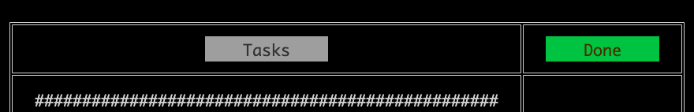
  </p>

- Create Cards in a terminal. (the best feature)

  <p align="center">
      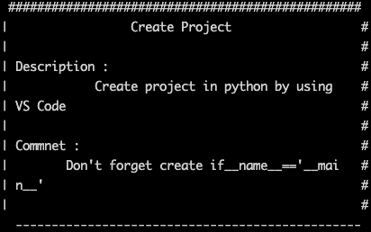
  </p>

- Easy move a card and put it on any column of the table

- Add a card or delete it after creating the table

- Viewing the history of edited table

___

## How to use

### Installation

#### Step 1

```terminal
git clone https://github.com/AmrMohamad/PyKanban.git
```

#### Step 2

```terminal
python3 -m venv <type-virtual-environment-name-you-want>
```

#### Step 3

  To activate virtual environment

```terminal
source env/bin/activate
```

#### Step 4

The following command will install the packages according to the configuration file <code>requirements.txt</code>

```terminal
pip install -r requirements.txt
```

#### Step 5

To Run PyKanban

```terminal
python3 pykanban.py
```

Or press Run button in VS Code

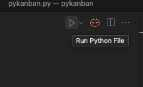

### Usage

After running, the first screen that appears is :

<p align="center">
    
</p>

we have here 3 options: View Tables, Create Table, Exit

Enter the option number

#### For View Tables

If you have created a table before, a list of saved tables will appear

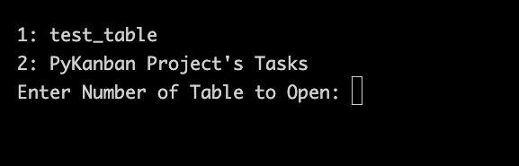

explaining the 'Create Table' and turn back to ['View Tables'](#back-to-view-tables-option)

#### For Create Table

It will ask you for the name of the new table to create a new folder in <code>./pykanban/data/</code> folder containing all new table data and the table be saved in a CSV file like this <code>latest.csv</code>.<br> After that, it starts asking you for the details of the table

Input:

```terminal
Number of stages => 4
```

It will ask about the Name of each stage or header and their colors. When come to choosing the colors they must be in Hex values like that:

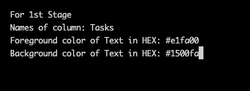

If you enter color values correctly, it continues in the same way until the last (4th) stage because we the enter <code> Number of stages => 4 </code>

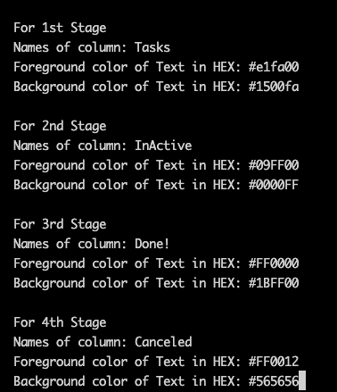

But, If you enter a hex value in the wrong way, it will ask you again about the values of the stage like that:

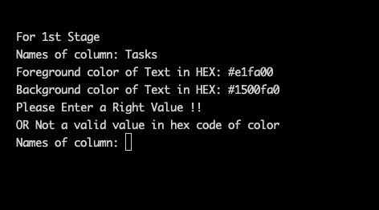

After setting the headers/columns/stages name of the table, you can add cards to Stages by asking about the number of cards per stage

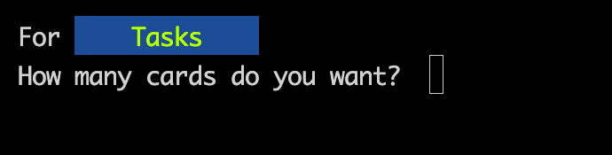

Input:

```terminal
How many cards do you want? 2
```

And depending on how many cards you choose to add, it will start asking you about each card's details like that:

```terminal
For 1st Card                    <====== First card start here
Enter the Title of Card, It's one title only !
==> Task 1
How many sub-titles do you want to add ? => 2
Enter the name of each sub-title
>>> Description
>>> Comment
Enter the content of each sub-title, The maximum is 244 characters per paragraph !
Do not hit enter for new line,
We handle it automatically
For Description :
>>> Lorem ipsum dolor sit amet, consectetur adipiscing elit, sed do eiusmod tempor incididunt ut labore et dolore magna aliqua.
Do not hit enter for new line,
We handle it automatically
For Comment :
>>> It should be ended on 7 Dec 2022         <====== First card end here
For 2nd Card                    <====== Second card start here
Enter the Title of Card, It's one title only !
==> 
```

And so on, the same way with the second card.

After you finished 1st Stage, it will ask about other stages, and it's up to you, you can add cards now or later

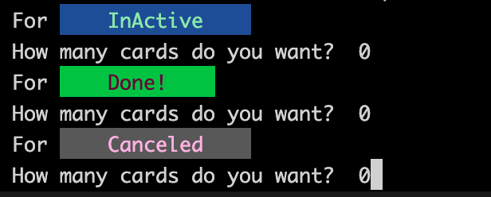

The Final result:

<p align="center">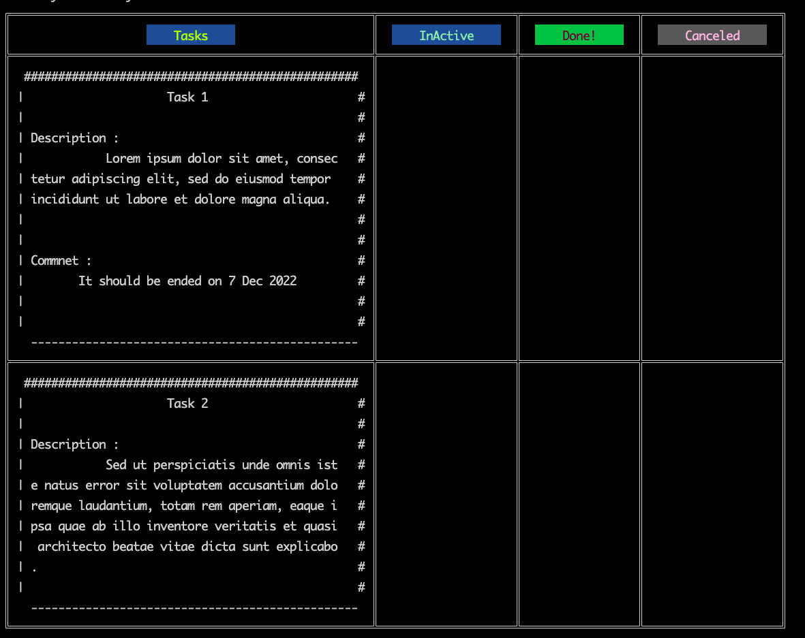</p>

⚠️ The Colors of the header showing/rendering in the terminal depend on the type of terminal ⚠️

In VS Code terminal (depending on your settings)

<p align="center"></p>

In macOS terminal

<p align="center">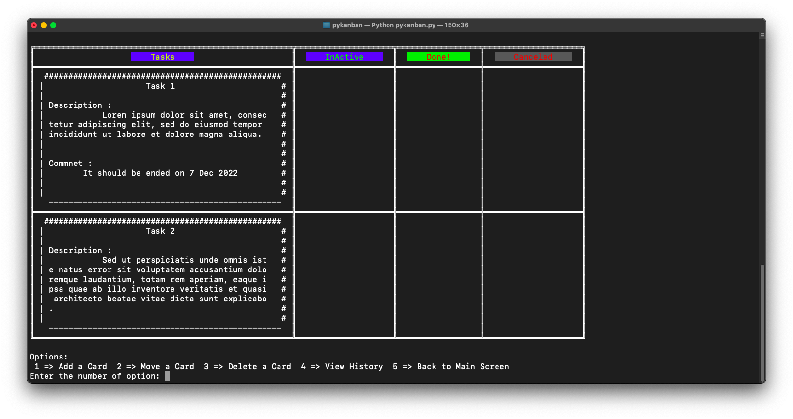</p>

The limitations are:

- The limited Number per Table of Stages is:

  - The Maximum Stages is 5
  - The Minimum Stages is 2

- No limit to Cards to Stage

- Sub-titles per card:

  - At least 1 sub-title
  - the maximum is 5 sub-titles

- the content of each sub-title is limited to 244 characters

Now you have created a Kanban board in the terminal with PyKanban 😄

#### For Exit

It takes 5 seconds to exit from PyKanban to make sure everything its saved

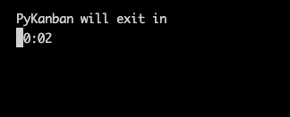

#### Back to View Tables option

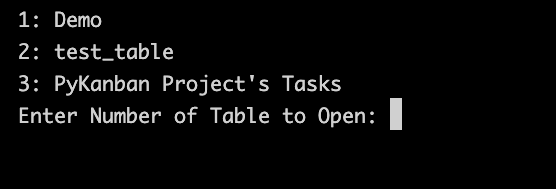

now after backing to main screen of PyKanban and choosing View Tables we can see <code>1: Dome</code> table

Enter the number of table in list. for example,

Input:

```terminal
Enter Number of Table to Open: 1
```

Now we can re-open the table that we created before

<p align="center">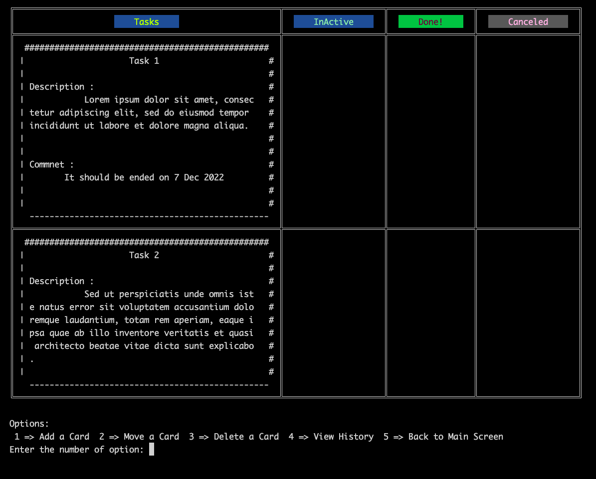</p>

and as we can see there is options:

<p align="center">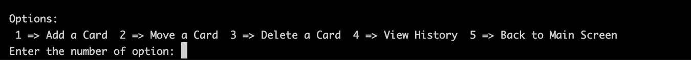</p>

- [Add a Card](#add-a-card)
- [Move a Card](#move-a-card)
- [Delete a Card](#delete-a-card)
- [View History](#view-history)
- [Back to Main Screen](#back-to-main-screen)

##### Add a Card

For adding a new card, just type 1 and press enter then its starting create the new card

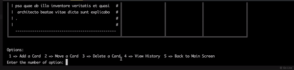

and continue as the same before when add cards during creating the table

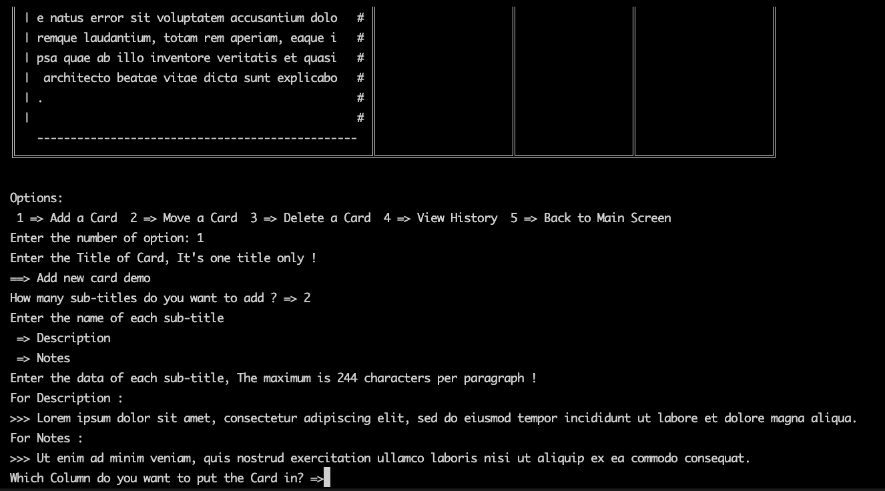

after adding the card information you want to add, it wll ask you where you want to add the card. let's say the task is done but if you forget to create a card for it, then we need to put the card in the <code>Done!</code> column.

⚠️ Enter the name of the column as is it in the table

Input:

```terminal
Which Column do you want to put the Card in? => Done!
```


##### Move a Card

For moving a card, just type 2 and press enter

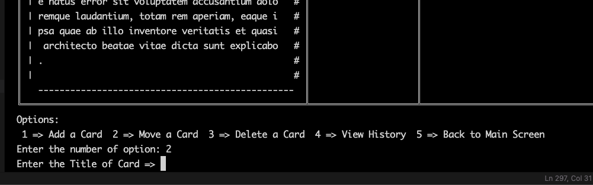

  Then type the Title of Card that you want to move

Input:

```terminal
Enter the Title of Card => Task 1
```

  <p align="center">
    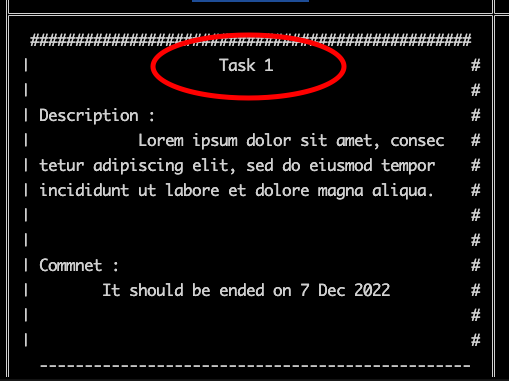 <br>
         <pr>The title of card</pr>
  </p>

Then Enter the column name where you want to put the card

⚠️ Enter the name of the column as is it in the table

Input:

```terminal
Which Column do you want to put the Card in? => InActive
```


Then it's moved

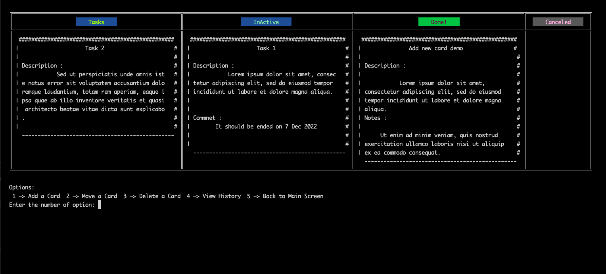

##### Delete a Card

let's say some modifications happened to the project so you do not need the 'Task 2' Card and want to delete it

Select 'Delete a Card' by just typing 3 and pressing enter

Then enter the Card name

Input:

```terminal
Enter the Title of Card => Task 2
```

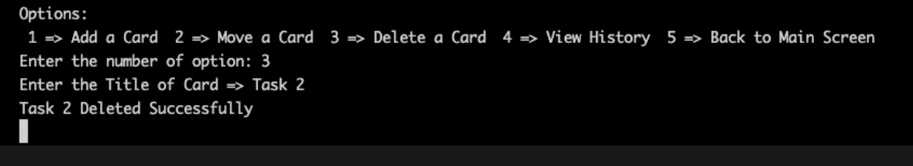


##### View History

For some reasons you need to remember or view old version/copy of the table

Select 'View History' by just typing 4 and pressing enter

It will view to you the history list and you will select which date you want to view by typing the number from the list

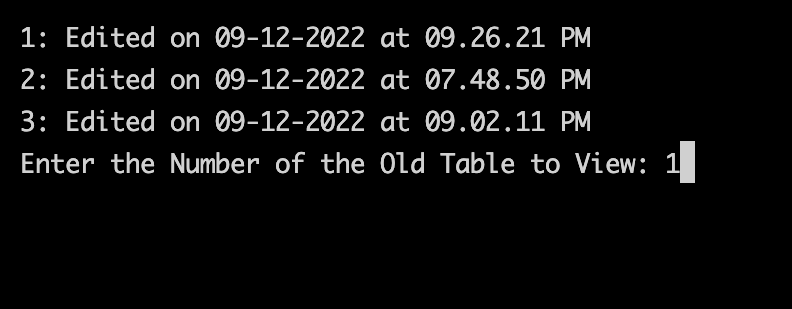

Then :

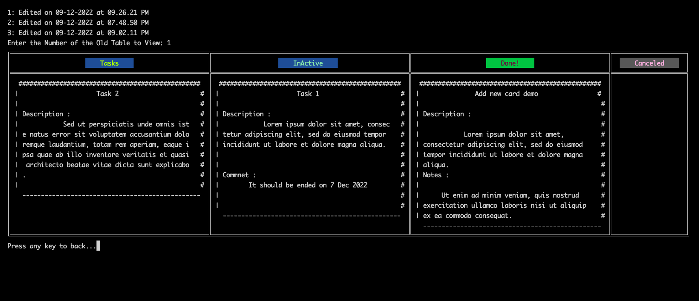

##### Back to Main Screen

For select 'Back to Main Screen' turns you back to the main screen just typing 5 and pressing enter

___

## Fundamentals and Technologies are used

### Programming Fundamentals

The Fundamentals are used to build PyKanban :

- Libraries & modules
- Constants
- Class Methods
- Decorators
- raise error message
- <code>def</code> for functions
- match statements
- Exceptions
- Unit Tests
- File I/O using <code>open</code>, <code>with</code> and <code>CSV</code> 
- Regular Expressions
- Type Hints
- Unpacking
- List Comprehensions and Dictionary Comprehensions
- <code>enumerate</code>

### Technologies

The Technologies are used to build PyKanban :

- <a href="https://docs.python.org/3.10/">Python v3.10</a>
- Modules are used:
  - <a href="https://docs.python.org/3.10/library/textwrap.html?highlight=textwrap#module-textwrap">textwrap</a> - This library is used to format text by wrapping it according to specified line widths.
  - <a href="https://pypi.org/project/tabulate/">tabulate 0.9.0</a> - This library is used to convert data into formatted tables.
    - The tabulate package is used to display tables on the terminal screen.
  - <a href="https://pypi.org/project/colored/">colored 1.4.4</a> - This library is used to add colors to the text output in the terminal.
    - The colored package is used to add color to the text on the screen.
  - <a href="https://pypi.org/project/inflect/">inflect 6.0.2 </a> - This library is used to perform various operations on words and numbers, such as pluralization and singularization.
    - The inflect package is used to convert numbers to their text representation (e.g. "1" to "one").
  - <a href="https://docs.python.org/3.10/library/csv.html?highlight=csv#module-csv">csv</a> - This library is used to read and write CSV (Comma Separated Values) files.
  - <a href="https://docs.python.org/3.10/library/os.html?highlight=os#module-os">os</a> - This library is used to perform various operations on files and directories, such as renaming and deleting files.
  - <a href="https://docs.python.org/3.10/library/shutil.html?highlight=shutil#module-shutil">shutil</a> - This library is used to perform high-level operations on files and directories, such as copying and moving files.
  - <a href="https://docs.python.org/3.10/library/sys.html?highlight=sys#module-sys">sys</a> - This library is used to access system-specific parameters and functions, such as command line arguments and exit codes.
  - <a href="https://docs.python.org/3.10/library/re.html?highlight=re#module-re">re</a> - This library is used to work with regular expressions, which are patterns used to match and manipulate strings.
  - <a href="https://docs.python.org/3.10/library/time.html?highlight=time#module-time">time</a> - This library is used to perform time-related operations, such as measuring time intervals and sleeping.
  - <a href="https://docs.python.org/3.10/library/datetime.html?highlight=datetime#module-datetime">datetime</a> - This library is used to perform operations on dates and times, such as calculating the difference between two dates.
  - ### For Units Test
    - <a href="https://pypi.org/project/pytest/">pytest 7.2.0</a> - is a unit testing framework for Python. It is used to write and run tests for Python code. Pytest makes it easy to write and run tests for your Python code, and it has a number of useful features that make it a powerful tool for testing. Pytest is particularly useful for ensuring that your code is working as expected, and it can be used to catch and diagnose bugs and other issues in your code. Overall, pytest is a valuable tool for ensuring the quality and reliability of your Python code.

____

## Code Explanation

For not making the README file long than that this is the <a href="./docs/CodeExplanation.md">Code Explanation</a> click here
