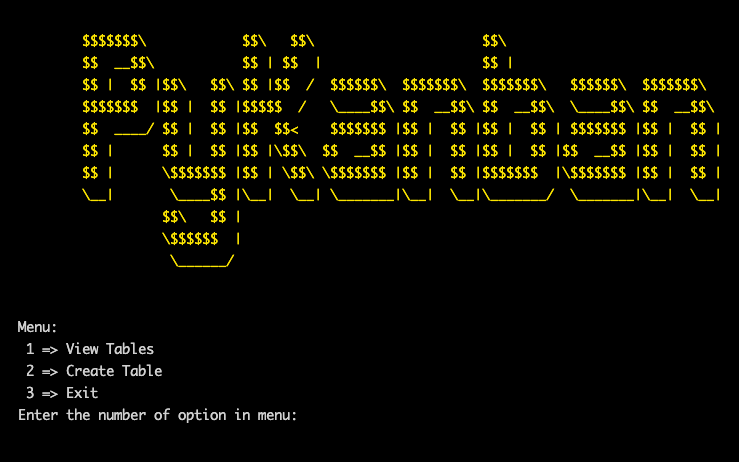

# PyKanban

    

___

## Table of Contents

- [Description](#description)
- [Motivation](#motivation)
- [Features](#features)
- [How to use](#how-to-use)
- [Fundamentals and Technologies are used]()
  - [Fundamentals]()
  - [Technologies]()
- [Code]()

___

## Description

PyKanban is a terminal application for creating a simple kanban board or any table for any purpose uses cards in an awesome terminal view

    

___

## Motivation

First, as is common among developers, it's awesome for using terminal applications. And I found all applications that help us for creating tables for organizing our tasks use GUI. So, I found it will be great if I try to develop a simple application that uses a terminal. Second, it's my final project for the course

___

## Features

- Allow you create a table with customized headers by coloring text and text background in the terminal.

  

    
  

- Create Cards in a terminal. (the best feature)

  

      
  

- Easy move a card and put on any column of the table

- Add a card or delete it after creating the table

- Viewing the history of edited table

___

## How to use 
